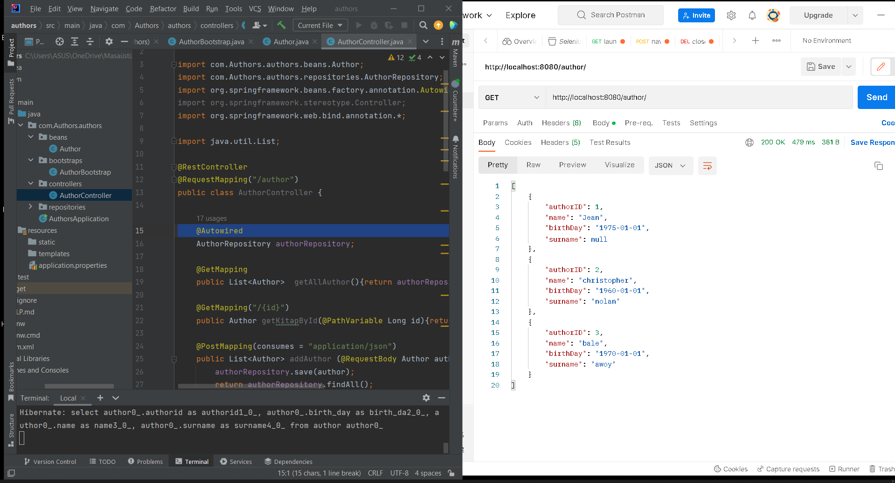

# Java-springboot-authors-service

This is a Java Spring project that manages authors with a RESTful API.

Class Structure
The project consists of the following classes:

Author: The model class that represents an author.
AuthorBootstrap: A class that initializes sample data for the Author class.
AuthorController: A REST controller class that handles requests and responses for the Author class.
Interface
The project includes the following interface:

AuthorRepository: An interface that defines CRUD (Create, Read, Update, Delete) operations for the Author class.
Packages
The project is structured into the following packages:

beans: Contains model classes.
controllers: Contains REST controller classes.
bootstraps: Contains classes that initialize sample data.
repositories: Contains repository interfaces.
Application Properties
The application.properties file includes the following configurations:
spring.jpa.show-sql=true
Use H2 (for development!)
spring.h2.console.enabled=true
spring.datasource.url=jdbc:h2:mem:testdb
spring.jpa.database=h2
spring.datasource.platform=h2
Maven Dependencies
The project includes the following Maven dependencies:

Spring Web: Provides support for building web applications.
Spring JPA: Provides support for Java Persistence API.
Spring DevTools: Provides support for development-time features.
H2: Provides support for an in-memory database.
Lombok: Provides support for reducing boilerplate code.

